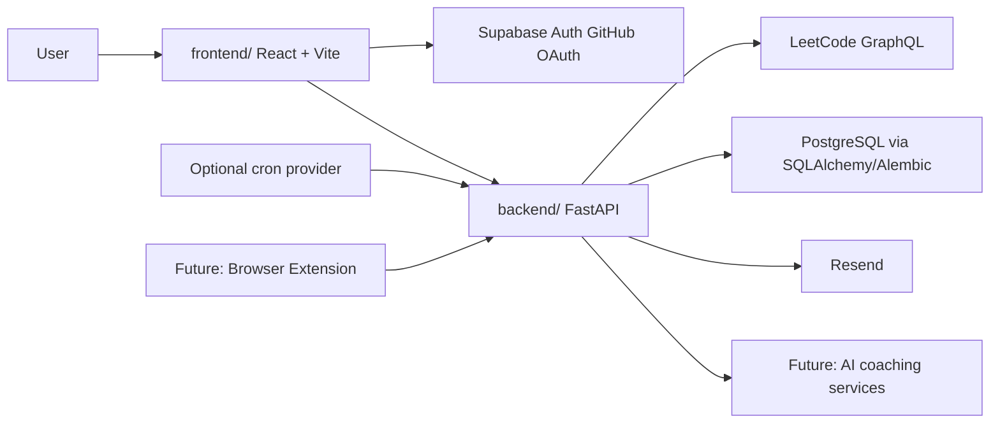

# LeetTrack Architecture

LeetTrack is organized as a monorepo with independent frontend and backend applications.

## Current Foundation

The current backend milestone includes:

- a React + Vite frontend shell;
- Supabase Auth frontend session handling with GitHub login;
- a FastAPI backend shell;
- a `/health` endpoint;
- a `POST /leetcode/sync` endpoint that fetches and persists recent accepted LeetCode submissions;
- a `GET /leetcode/submissions` endpoint used by the dashboard to display persisted submissions;
- app-open LeetCode refresh using the user's saved username;
- manual weekly summary email sending through Resend;
- optional cron-safe weekly summary dispatch for opted-in users that refreshes saved LeetCode data before sending;
- Alembic-managed tables for LeetCode accounts, problems, and submissions;
- documentation for setup and workflow.

## Boundaries

The frontend owns presentation, routing, UI state, and API calls.

The frontend also owns the Supabase browser session. When a user is signed in, frontend API calls attach the Supabase access token as a bearer token.

The backend owns API contracts, validation, authentication, persistence, scheduled jobs, and external integrations. Protected endpoints verify the bearer token with Supabase Auth and scope LeetCode account data by authenticated user id. LeetCode communication is isolated behind a client/service boundary so the rest of the application does not depend directly on LeetCode's GraphQL response shape.

Database schema changes go through Alembic migrations. We do not modify production schema manually.

## Persistence Model

`leetcode_accounts` stores the authenticated Supabase user id, tracked LeetCode username, and last sync timestamp.

`problems` stores platform-level problem identity such as `leetcode/two-sum`.

`submissions` links an account to a problem at a specific submission time. A unique constraint on account, problem, and submitted timestamp prevents duplicate rows when sync is run repeatedly.

`problem_notes` stores user-authored notes attached to synced or tracked problems.

`tracked_problems` stores user-saved LeetCode problems detected by the browser extension before they are counted as solved submissions.

`email_preferences` stores per-user email settings such as whether weekly reports are opted in. Manual sends remain explicit user actions unless a scheduler is configured.

`email_delivery_attempts` stores automated email delivery audit records, including the weekly period, recipient, status, provider message id, sync status, sync counts, and failure reason when available. This prevents duplicate automated weekly sends when a scheduler is configured and gives us a production debugging trail.

The frontend dashboard reads from the backend API instead of product-facing mock data. Dashboard views focus on analytics and progress inspection, while account-level controls such as LeetCode sync and email preferences live in Settings. Test fixtures and fake clients remain acceptable inside automated tests.

## Why This Structure

Keeping the apps independent makes each layer easier to test, deploy, and reason about. Keeping them in one repository keeps the portfolio story, documentation, and pull requests easy to follow.
