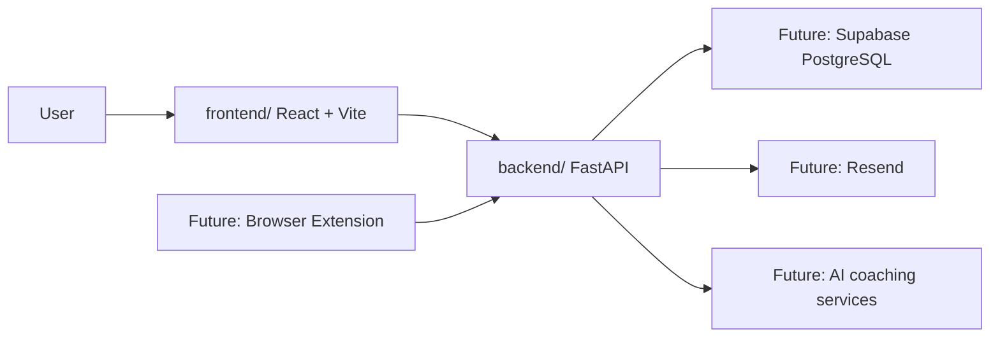

# LeetTrack Architecture

LeetTrack is organized as a monorepo with independent frontend and backend applications.

## Current Foundation

The current milestone includes:

- a React + Vite frontend shell;
- a FastAPI backend shell;
- a `/health` endpoint;
- documentation for setup and workflow.

## Boundaries

The frontend owns presentation, routing, UI state, and API calls.

The backend owns API contracts, validation, authentication, persistence, scheduled jobs, and external integrations.

The database will be introduced through migrations when we build the first persistent feature. We will not modify the database manually.

## Why This Structure

Keeping the apps independent makes each layer easier to test, deploy, and reason about. Keeping them in one repository keeps the portfolio story, documentation, and pull requests easy to follow.
