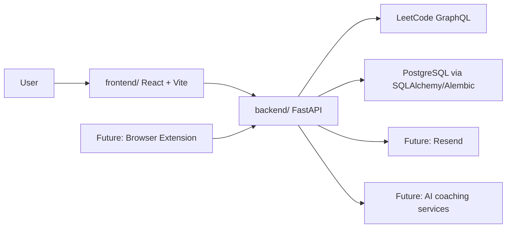

# LeetTrack Architecture

LeetTrack is organized as a monorepo with independent frontend and backend applications.

## Current Foundation

The current backend milestone includes:

- a React + Vite frontend shell;
- a FastAPI backend shell;
- a `/health` endpoint;
- a `POST /leetcode/sync` endpoint that fetches and persists recent accepted LeetCode submissions;
- Alembic-managed tables for LeetCode accounts, problems, and submissions;
- documentation for setup and workflow.

## Boundaries

The frontend owns presentation, routing, UI state, and API calls.

The backend owns API contracts, validation, authentication, persistence, scheduled jobs, and external integrations. LeetCode communication is isolated behind a client/service boundary so the rest of the application does not depend directly on LeetCode's GraphQL response shape.

Database schema changes go through Alembic migrations. We do not modify production schema manually.

## Persistence Model

`leetcode_accounts` stores the tracked LeetCode username and last sync timestamp.

`problems` stores platform-level problem identity such as `leetcode/two-sum`.

`submissions` links an account to a problem at a specific submission time. A unique constraint on account, problem, and submitted timestamp prevents duplicate rows when sync is run repeatedly.

## Why This Structure

Keeping the apps independent makes each layer easier to test, deploy, and reason about. Keeping them in one repository keeps the portfolio story, documentation, and pull requests easy to follow.
