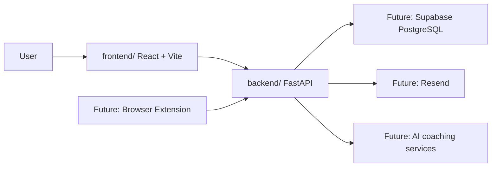

# Project Foundation Implementation Plan

> **For agentic workers:** REQUIRED SUB-SKILL: Use superpowers:subagent-driven-development (recommended) or superpowers:executing-plans to implement this plan task-by-task. Steps use checkbox (`- [ ]`) syntax for tracking.

**Goal:** Initialize LeetTrack as a professional monorepo with runnable frontend and backend skeletons plus useful project documentation.

**Architecture:** The repository will contain independent `frontend/` and `backend/` applications, with `docs/` explaining architecture and workflow. The frontend will be a Vite React TypeScript app shell, and the backend will be a FastAPI app exposing a deterministic `/health` endpoint.

**Tech Stack:** React, Vite, TypeScript, FastAPI, Pydantic, Uvicorn, Markdown documentation, Git.

---

## Issue

GitHub Issue: `#1`  
URL: `https://github.com/kprashanth01/leettrack/issues/1`

## Branch

Create and work on:

```bash
git switch -c feature/project-foundation
```

## File Structure

Create or modify these files:

- Create: `.gitignore`
- Create: `README.md`
- Create: `frontend/package.json`
- Create: `frontend/index.html`
- Create: `frontend/tsconfig.json`
- Create: `frontend/tsconfig.node.json`
- Create: `frontend/vite.config.ts`
- Create: `frontend/src/App.tsx`
- Create: `frontend/src/main.tsx`
- Create: `frontend/src/styles.css`
- Create: `backend/README.md`
- Create: `backend/requirements.txt`
- Create: `backend/app/__init__.py`
- Create: `backend/app/main.py`
- Create: `backend/app/schemas.py`
- Create: `docs/architecture.md`
- Create: `docs/development-workflow.md`
- Create: `docs/setup.md`
- Modify: `docs/superpowers/specs/2026-06-30-foundation-first-design.md`

The spec modification should update the outdated note that said the local repository had no GitHub remote. The remote now exists.

---

### Task 1: Create Branch And Root Project Hygiene

**Files:**
- Create: `.gitignore`
- Create: `README.md`
- Modify: `docs/superpowers/specs/2026-06-30-foundation-first-design.md`

- [ ] **Step 1: Create the feature branch**

Run:

```bash
git switch -c feature/project-foundation
```

Expected: Git switches to a new branch named `feature/project-foundation`.

- [ ] **Step 2: Add `.gitignore`**

Create `.gitignore`:

```gitignore
# OS and editor files
.DS_Store
Thumbs.db
.idea/
.vscode/

# Local environment files
.env
.env.*
!.env.example

# Python
__pycache__/
*.py[cod]
.pytest_cache/
.mypy_cache/
.ruff_cache/
.venv/
venv/

# Node
node_modules/
dist/
build/
.vite/
npm-debug.log*
pnpm-debug.log*
yarn-debug.log*

# Local brainstorming artifacts
.superpowers/
```

- [ ] **Step 3: Add root README**

Create `README.md`:

```markdown
# LeetTrack

LeetTrack is an AI-powered competitive programming tracker for logging solved LeetCode problems, reviewing notes, analyzing progress, and eventually receiving personalized coaching reports.

This repository is being built incrementally as a professional full-stack portfolio project. Each milestone is scoped through a GitHub issue, design notes, an implementation plan, code review, and a focused commit.

## Current Status

The project is in its foundation milestone:

- `frontend/` contains the React + Vite + TypeScript app shell.
- `backend/` contains the FastAPI app shell.
- `docs/` contains architecture, setup, and workflow documentation.

Product features such as authentication, problem logging, analytics, email reports, browser extension support, and AI coaching will be added in later milestones.

## Repository Structure

```text
leettrack/
  frontend/   React + Vite + TypeScript application
  backend/    FastAPI application
  docs/       Architecture, setup, and development workflow notes
```

## Local Development

Read the setup guide first:

```text
docs/setup.md
```

Quick commands:

```bash
cd frontend
npm install
npm run dev
```

```bash
cd backend
python -m venv .venv
.venv\Scripts\activate
pip install -r requirements.txt
uvicorn app.main:app --reload
```

## Development Workflow

Each feature should follow this sequence:

1. Explain the objective and architecture.
2. Create or reference a GitHub issue.
3. Write a development plan.
4. Create a `feature/`, `fix/`, `refactor/`, `docs/`, or `chore/` branch.
5. Implement one logical unit of work.
6. Verify manually and with tests where applicable.
7. Review the code.
8. Commit using Conventional Commits.
9. Merge only after review.

## Documentation

- `docs/architecture.md` explains the high-level system boundaries.
- `docs/setup.md` explains local setup.
- `docs/development-workflow.md` explains how changes should move from idea to merge.
```

- [ ] **Step 4: Update the design spec remote note**

In `docs/superpowers/specs/2026-06-30-foundation-first-design.md`, replace:

```markdown
The local repository currently has no GitHub remote configured. A real issue can be created after the GitHub repository full name is known, for example `owner/leettrack`.
```

With:

```markdown
GitHub Issue #1 was created manually at `https://github.com/kprashanth01/leettrack/issues/1` after the GitHub connector lacked permission to create issues. The local repository remote is configured as `https://github.com/kprashanth01/leettrack.git`.
```

- [ ] **Step 5: Verify Task 1 files**

Run:

```bash
git status --short
```

Expected: `.gitignore`, `README.md`, and the spec file show as changed or new.

---

### Task 2: Create FastAPI Backend Skeleton

**Files:**
- Create: `backend/README.md`
- Create: `backend/requirements.txt`
- Create: `backend/app/__init__.py`
- Create: `backend/app/main.py`
- Create: `backend/app/schemas.py`

- [ ] **Step 1: Add backend dependencies**

Create `backend/requirements.txt`:

```text
fastapi==0.115.6
uvicorn[standard]==0.34.0
pydantic==2.10.4
```

- [ ] **Step 2: Add backend package marker**

Create `backend/app/__init__.py`:

```python
"""LeetTrack backend application package."""
```

- [ ] **Step 3: Add health response schema**

Create `backend/app/schemas.py`:

```python
from pydantic import BaseModel


class HealthResponse(BaseModel):
    status: str
    service: str
```

- [ ] **Step 4: Add FastAPI application**

Create `backend/app/main.py`:

```python
from fastapi import FastAPI

from app.schemas import HealthResponse

app = FastAPI(
    title="LeetTrack API",
    description="Backend API for the LeetTrack competitive programming tracker.",
    version="0.1.0",
)


@app.get("/health", response_model=HealthResponse, tags=["system"])
def health_check() -> HealthResponse:
    return HealthResponse(status="ok", service="leettrack-api")
```

- [ ] **Step 5: Add backend README**

Create `backend/README.md`:

```markdown
# LeetTrack Backend

The backend is a FastAPI application. It will eventually own authentication, problem logs, analytics APIs, email scheduling, and AI-assisted coaching endpoints.

For the foundation milestone, it exposes only a health endpoint.

## Setup

```bash
python -m venv .venv
.venv\Scripts\activate
pip install -r requirements.txt
```

## Run

```bash
uvicorn app.main:app --reload
```

Open:

```text
http://127.0.0.1:8000/health
```

Expected response:

```json
{
  "status": "ok",
  "service": "leettrack-api"
}
```

## API Docs

FastAPI automatically provides OpenAPI docs at:

```text
http://127.0.0.1:8000/docs
```
```

- [ ] **Step 6: Install and verify backend**

Run:

```bash
cd backend
python -m venv .venv
.venv\Scripts\activate
pip install -r requirements.txt
python -m uvicorn app.main:app --host 127.0.0.1 --port 8000
```

Expected: Uvicorn starts without import errors. In a separate terminal, request:

```bash
curl http://127.0.0.1:8000/health
```

Expected JSON:

```json
{"status":"ok","service":"leettrack-api"}
```

Stop the server after verification.

---

### Task 3: Create Vite React Frontend Skeleton

**Files:**
- Create: `frontend/package.json`
- Create: `frontend/index.html`
- Create: `frontend/tsconfig.json`
- Create: `frontend/tsconfig.node.json`
- Create: `frontend/vite.config.ts`
- Create: `frontend/src/App.tsx`
- Create: `frontend/src/main.tsx`
- Create: `frontend/src/styles.css`

- [ ] **Step 1: Add frontend package manifest**

Create `frontend/package.json`:

```json
{
  "name": "leettrack-frontend",
  "private": true,
  "version": "0.1.0",
  "type": "module",
  "scripts": {
    "dev": "vite",
    "build": "tsc -b && vite build",
    "preview": "vite preview"
  },
  "dependencies": {
    "@vitejs/plugin-react": "latest",
    "vite": "latest",
    "typescript": "latest",
    "react": "latest",
    "react-dom": "latest"
  },
  "devDependencies": {
    "@types/react": "latest",
    "@types/react-dom": "latest"
  }
}
```

- [ ] **Step 2: Add frontend HTML entry**

Create `frontend/index.html`:

```html
<!doctype html>
<html lang="en">
  <head>
    <meta charset="UTF-8" />
    <meta name="viewport" content="width=device-width, initial-scale=1.0" />
    <title>LeetTrack</title>
  </head>
  <body>
    <div id="root"></div>
    <script type="module" src="/src/main.tsx"></script>
  </body>
</html>
```

- [ ] **Step 3: Add TypeScript app config**

Create `frontend/tsconfig.json`:

```json
{
  "compilerOptions": {
    "target": "ES2020",
    "useDefineForClassFields": true,
    "lib": ["DOM", "DOM.Iterable", "ES2020"],
    "allowJs": false,
    "skipLibCheck": true,
    "esModuleInterop": true,
    "allowSyntheticDefaultImports": true,
    "strict": true,
    "forceConsistentCasingInFileNames": true,
    "module": "ESNext",
    "moduleResolution": "Node",
    "resolveJsonModule": true,
    "isolatedModules": true,
    "noEmit": true,
    "jsx": "react-jsx"
  },
  "include": ["src"],
  "references": [{ "path": "./tsconfig.node.json" }]
}
```

- [ ] **Step 4: Add TypeScript Node config**

Create `frontend/tsconfig.node.json`:

```json
{
  "compilerOptions": {
    "composite": true,
    "module": "ESNext",
    "moduleResolution": "Node",
    "allowSyntheticDefaultImports": true
  },
  "include": ["vite.config.ts"]
}
```

- [ ] **Step 5: Add Vite config**

Create `frontend/vite.config.ts`:

```ts
import { defineConfig } from "vite";
import react from "@vitejs/plugin-react";

export default defineConfig({
  plugins: [react()],
});
```

- [ ] **Step 6: Add React entry point**

Create `frontend/src/main.tsx`:

```tsx
import React from "react";
import ReactDOM from "react-dom/client";

import App from "./App";
import "./styles.css";

ReactDOM.createRoot(document.getElementById("root") as HTMLElement).render(
  <React.StrictMode>
    <App />
  </React.StrictMode>,
);
```

- [ ] **Step 7: Add app shell component**

Create `frontend/src/App.tsx`:

```tsx
const foundationItems = [
  "React + Vite frontend shell",
  "FastAPI backend health endpoint",
  "Architecture and setup documentation",
];

function App() {
  return (
    <main className="app-shell">
      <section className="hero">
        <p className="eyebrow">Foundation milestone</p>
        <h1>LeetTrack</h1>
        <p className="summary">
          A competitive programming tracker being built step by step with clean
          architecture, thoughtful documentation, and professional Git workflow.
        </p>
      </section>

      <section className="panel" aria-labelledby="foundation-heading">
        <h2 id="foundation-heading">What exists in this milestone</h2>
        <ul>
          {foundationItems.map((item) => (
            <li key={item}>{item}</li>
          ))}
        </ul>
      </section>
    </main>
  );
}

export default App;
```

- [ ] **Step 8: Add frontend styles**

Create `frontend/src/styles.css`:

```css
:root {
  color: #172033;
  background: #f5f7fb;
  font-family:
    Inter, ui-sans-serif, system-ui, -apple-system, BlinkMacSystemFont, "Segoe UI",
    sans-serif;
  font-synthesis: none;
  text-rendering: optimizeLegibility;
}

* {
  box-sizing: border-box;
}

body {
  margin: 0;
  min-width: 320px;
  min-height: 100vh;
}

.app-shell {
  display: grid;
  gap: 24px;
  width: min(960px, calc(100% - 32px));
  margin: 0 auto;
  padding: 64px 0;
}

.hero,
.panel {
  border: 1px solid #d8deea;
  border-radius: 8px;
  background: #ffffff;
  padding: 28px;
}

.eyebrow {
  margin: 0 0 8px;
  color: #2563eb;
  font-size: 0.78rem;
  font-weight: 700;
  text-transform: uppercase;
}

h1,
h2,
p {
  margin-top: 0;
}

h1 {
  margin-bottom: 12px;
  font-size: clamp(2.5rem, 8vw, 4.5rem);
  line-height: 1;
}

h2 {
  margin-bottom: 16px;
  font-size: 1.25rem;
}

.summary {
  max-width: 680px;
  margin-bottom: 0;
  color: #43516a;
  font-size: 1.1rem;
  line-height: 1.7;
}

ul {
  display: grid;
  gap: 12px;
  margin: 0;
  padding-left: 20px;
}

li {
  color: #344258;
}
```

- [ ] **Step 9: Install and verify frontend**

Run:

```bash
cd frontend
npm install
npm run build
npm run dev
```

Expected: build succeeds, and the dev server serves the app shell. Stop the dev server after verification.

---

### Task 4: Add Project Documentation

**Files:**
- Create: `docs/architecture.md`
- Create: `docs/development-workflow.md`
- Create: `docs/setup.md`

- [ ] **Step 1: Add architecture documentation**

Create `docs/architecture.md`:

```markdown
# LeetTrack Architecture

LeetTrack is organized as a monorepo with independent frontend and backend applications.



## Current Foundation

The current milestone includes:

- a React + Vite frontend shell;
- a FastAPI backend shell;
- a `/health` endpoint;
- documentation for setup and workflow.

## Boundaries

The frontend owns presentation, routing, UI state, and API calls.

The backend owns API contracts, validation, authentication, persistence, scheduled jobs, and external integrations.

The database will be introduced through migrations when we build the first persistent feature. We will not modify the database manually.

## Why This Structure

Keeping the apps independent makes each layer easier to test, deploy, and reason about. Keeping them in one repository keeps the portfolio story, documentation, and pull requests easy to follow.
```

- [ ] **Step 2: Add setup documentation**

Create `docs/setup.md`:

```markdown
# Setup Guide

This guide explains how to run the LeetTrack foundation locally.

## Prerequisites

- Node.js for the frontend.
- Python 3.11 or newer for the backend.
- Git for version control.

## Frontend

```bash
cd frontend
npm install
npm run dev
```

The Vite dev server prints a local URL, usually:

```text
http://localhost:5173
```

## Backend

```bash
cd backend
python -m venv .venv
.venv\Scripts\activate
pip install -r requirements.txt
uvicorn app.main:app --reload
```

Health check:

```text
http://127.0.0.1:8000/health
```

Expected response:

```json
{
  "status": "ok",
  "service": "leettrack-api"
}
```

## Common Issues

If a port is already in use, stop the other server or choose a different port.

If Python dependencies are missing, confirm the virtual environment is activated before running `pip install`.

If frontend dependencies are missing, run `npm install` inside `frontend/`, not at the repository root.
```

- [ ] **Step 3: Add development workflow documentation**

Create `docs/development-workflow.md`:

```markdown
# Development Workflow

LeetTrack is built one professional milestone at a time.

## Standard Sequence

1. Explain the objective.
2. Explain the architecture involved.
3. Explain important concepts.
4. Create or reference a GitHub issue.
5. Create a development plan.
6. Create a feature branch.
7. Implement the feature.
8. Explain important files.
9. Review the code.
10. Suggest improvements.
11. Commit with a professional message.
12. Merge only after review.

## Branch Naming

Use these prefixes:

- `feature/` for new capabilities;
- `fix/` for bug fixes;
- `refactor/` for behavior-preserving code improvements;
- `docs/` for documentation-only changes;
- `chore/` for maintenance tasks.

## Commit Style

Use Conventional Commits:

```text
feat(project): initialize LeetTrack foundation
docs(project): add architecture guide
fix(api): validate empty notes before insertion
```

## Scope Rule

Each branch should represent one logical unit of work. Avoid mixing unrelated setup, UI, API, and database changes in one commit.
```

- [ ] **Step 4: Verify docs links**

Read `README.md`, `docs/architecture.md`, `docs/setup.md`, and `docs/development-workflow.md`.

Expected: commands and folder names match the actual files created in Tasks 1 through 3.

---

### Task 5: Final Verification And Review

**Files:**
- Review all changed files.

- [ ] **Step 1: Check repository status**

Run:

```bash
git status --short --branch
```

Expected: branch is `feature/project-foundation`, and only planned files are changed. `.superpowers/` should be ignored after `.gitignore` exists.

- [ ] **Step 2: Build frontend**

Run:

```bash
cd frontend
npm run build
```

Expected: TypeScript and Vite build complete successfully.

- [ ] **Step 3: Verify backend import**

Run:

```bash
cd backend
.venv\Scripts\activate
python -c "from app.main import app; print(app.title)"
```

Expected output:

```text
LeetTrack API
```

- [ ] **Step 4: Verify backend health endpoint manually**

Run:

```bash
cd backend
.venv\Scripts\activate
uvicorn app.main:app --host 127.0.0.1 --port 8000
```

In another terminal:

```bash
curl http://127.0.0.1:8000/health
```

Expected:

```json
{"status":"ok","service":"leettrack-api"}
```

Stop the backend server after verification.

- [ ] **Step 5: Review code for scope creep**

Confirm these are not present:

- authentication logic;
- database models;
- Alembic migrations;
- dashboard CRUD features;
- email scheduling;
- AI endpoints;
- browser extension files.

- [ ] **Step 6: Stage and commit**

Run:

```bash
git add .gitignore README.md frontend backend docs
git commit -m "feat(project): initialize LeetTrack foundation"
```

Expected: one implementation commit on `feature/project-foundation`.

---

## Manual Testing Steps

- Open the frontend dev server URL and confirm the LeetTrack foundation page renders.
- Open `http://127.0.0.1:8000/health` and confirm the JSON health response.
- Open `http://127.0.0.1:8000/docs` and confirm FastAPI generated OpenAPI docs.
- Read `README.md` and confirm a new developer could find setup instructions.

## Edge Cases

- If `npm install` fails, check the installed Node.js version and retry inside `frontend/`.
- If `uvicorn` is not found, activate `backend/.venv` and reinstall `backend/requirements.txt`.
- If port `8000` is busy, run `uvicorn app.main:app --port 8001` and update the manual test URL for that session.
- If port `5173` is busy, Vite will usually choose another port and print it in the terminal.

## Future Improvements

- Add TailwindCSS and shadcn/ui when the dashboard shell is built.
- Add React Router when the app has more than one route.
- Add TanStack Query and Axios when the frontend starts calling backend APIs.
- Add SQLAlchemy, Alembic, and Supabase when problem logging requires persistence.
- Add automated tests once there is behavior beyond startup and health checks.

## Plan Self-Review

- Spec coverage: This plan covers the monorepo structure, minimal frontend, minimal backend, docs, health endpoint, and verification steps required by Issue #1.
- Placeholder scan: No `TBD`, `TODO`, or intentionally vague implementation steps remain.
- Type consistency: The backend health endpoint returns `HealthResponse(status="ok", service="leettrack-api")`, matching all docs and verification steps.
