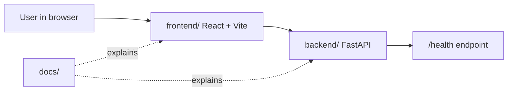

# LeetTrack Foundation First Design

## Objective

Build the initial professional foundation for LeetTrack as a monorepo with separate frontend, backend, and documentation areas. This milestone should produce a small, runnable skeleton, not a full product feature.

## Why This Comes First

LeetTrack will eventually include authentication, problem logging, analytics, email jobs, a browser extension, and AI coaching. Those features depend on clear boundaries between the user interface, API, database, background jobs, and external services. Starting with foundation work prevents early shortcuts from becoming architecture debt.

This milestone teaches the project setup habits used in professional teams:

- define repo structure before features;
- document how to run and reason about the system;
- keep frontend and backend independent;
- create small commits that map to one logical unit of work;
- verify each app can run locally before adding business logic.

## Chosen Approach

Use a runnable skeleton foundation:

```text
leettrack/
  frontend/
  backend/
  docs/
```

The frontend will be a minimal React, Vite, and TypeScript app shell. The backend will be a minimal FastAPI app with a health endpoint. The documentation area will explain setup, architecture, workflow, and the intended folder structure.

This is intentionally smaller than the final stack. TailwindCSS, shadcn/ui, React Router, TanStack Query, Axios, SQLAlchemy, Alembic, Supabase, GitHub OAuth, Resend, and deployment configuration will be introduced later when the feature being built actually needs them.

## Alternatives Considered

### Documentation-only foundation

This would create only README and architecture docs. It is fast and keeps the first commit tiny, but the repo would still have no runnable application. That makes the next feature do too much setup work.

### Runnable skeleton foundation

This creates the folder structure, minimal frontend, minimal backend, and docs. It gives us working local commands while keeping the scope small. This is the recommended and approved approach.

### Full toolchain foundation

This would add all planned libraries, database migrations, Docker, CI, styling, deployment placeholders, and test frameworks immediately. It looks professional, but it bundles too many concepts into one milestone and violates the rule against building too much at once.

## Architecture



The frontend owns presentation and client-side interaction. The backend owns server-side API contracts, validation, authentication, data access, scheduled jobs, and AI integrations as those features are introduced. The database is intentionally out of scope for this first milestone.

## Folder Responsibilities

```text
frontend/
  A standalone Vite React TypeScript application.

backend/
  A standalone FastAPI application.

docs/
  Architecture, setup, workflow, and future system notes.

docs/superpowers/
  Design specs and implementation plans used during the mentored build.
```

## First GitHub Issue

Create a GitHub issue before implementation using this draft:

Title:

```text
Initialize LeetTrack project foundation
```

Body:

```markdown
## Objective

Create the initial LeetTrack monorepo foundation with separate frontend, backend, and documentation areas.

## Scope

- Create a minimal React + Vite + TypeScript frontend skeleton.
- Create a minimal FastAPI backend skeleton with a health endpoint.
- Add project documentation for setup, architecture, folder structure, and development workflow.
- Verify both apps can run locally.

## Out of Scope

- Authentication
- Database schema
- Problem logging
- Dashboard UI implementation
- Email jobs
- Browser extension
- AI features
- Deployment

## Acceptance Criteria

- Repository has `frontend/`, `backend/`, and `docs/` directories.
- Frontend has a documented local run command.
- Backend has a documented local run command.
- Backend exposes a basic health endpoint.
- README explains what LeetTrack is and how to work on it.
- Documentation includes a high-level architecture diagram.
```

GitHub Issue #1 was created manually at `https://github.com/kprashanth01/leettrack/issues/1` after the GitHub connector lacked permission to create issues. The local repository remote is configured as `https://github.com/kprashanth01/leettrack.git`.

## Feature Branch

Use this branch name for implementation:

```text
feature/project-foundation
```

This follows the requested `feature/` convention and keeps the branch scoped to one logical milestone.

## Implementation Scope

Implementation should include:

- root README;
- root `.gitignore`;
- `frontend/` minimal Vite React TypeScript app;
- `backend/` minimal FastAPI app;
- docs for architecture, setup, workflow, and folder structure;
- manual verification steps for frontend and backend.

Implementation should not include:

- database models;
- OAuth;
- TailwindCSS or shadcn/ui;
- real dashboard features;
- API routes for solved problems;
- deployment setup;
- browser extension files;
- AI integrations.

## Important Concepts To Teach

### Monorepo

A monorepo stores related applications in one repository. For LeetTrack, this keeps portfolio history, docs, frontend, and backend together while allowing each app to remain independently runnable.

### Separation of concerns

The frontend should not know database details. The backend should not know UI layout details. Each layer should expose clear interfaces to the next layer.

### Thin first milestone

A foundation milestone should prove the system can run and be extended. It should not solve product behavior yet.

### Documentation as engineering work

Professional projects treat setup, architecture, workflow, and decision records as part of the product. Good docs reduce onboarding time and make future code review easier.

## Testing And Verification

Manual verification for this milestone should include:

- run the frontend dev server and confirm the app shell loads;
- run the backend dev server and confirm `/health` returns a healthy response;
- confirm setup instructions work from a clean checkout;
- confirm docs match the actual folder structure and commands.

Edge cases to keep in mind:

- missing Node or Python dependencies;
- ports already in use;
- virtual environment not activated;
- frontend and backend run commands drifting from README instructions.

## Review Checklist

- The project does not include future features prematurely.
- The folder structure is easy to explain.
- The README is useful to a new developer.
- The backend health endpoint is simple and deterministic.
- The frontend skeleton is not pretending to be a finished dashboard.
- The commit message uses Conventional Commits.

## Suggested Commit Message

```text
docs(project): define foundation milestone design
```

The implementation commit should be separate and likely use:

```text
feat(project): initialize LeetTrack foundation
```

## Next Milestone After Foundation

After this foundation is reviewed and merged, the next good milestone is an application shell for the frontend dashboard using mock data. Authentication and persistence should come after the UI and API contracts are clearer.
