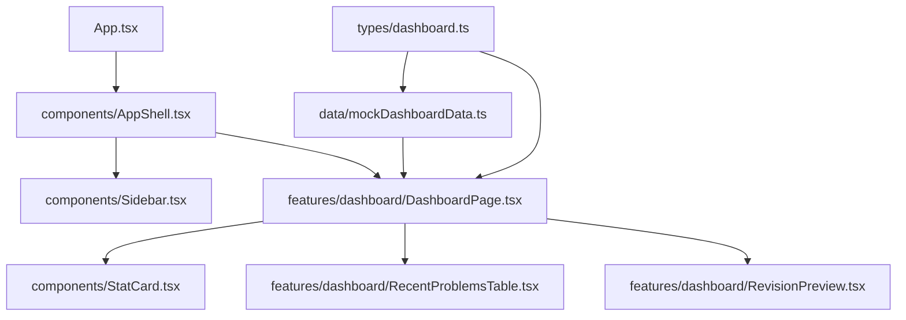

# Frontend Dashboard App Shell Design

## Objective

Build the first real LeetTrack frontend screen: a dashboard-style app shell using mock data. This milestone replaces the foundation placeholder page with a useful dashboard structure while keeping backend integration, authentication, persistence, and advanced product behavior out of scope.

GitHub Issue: `https://github.com/kprashanth01/leettrack/issues/3`

## Why This Comes Next

The foundation milestone proved that the frontend and backend can run independently. The next professional step is to shape the user experience before designing database tables or API routes. A mock-data dashboard helps us learn what information the product needs without prematurely committing to backend contracts.

This milestone teaches:

- frontend folder organization;
- component boundaries;
- TypeScript data modeling;
- mock-data-driven UI development;
- responsive dashboard layout;
- scope control before backend work.

## Chosen Approach

Use a workbench dashboard layout:

```text
Sidebar navigation
Main dashboard area
  Header / daily focus
  Summary stat cards
  Recent solved problems
  Notes and revision preview
```

This layout is best for daily LeetCode tracking because it balances quick progress signals with the concrete problem history a user will revisit often.

## Alternatives Considered

### Table-first tracker

This approach makes the problem log table dominate the page. It is useful for search and filtering, but it feels closer to a spreadsheet than a dashboard. It also pulls us toward implementing filters and CRUD too early.

### Coaching home

This approach emphasizes AI recommendations and personalized focus areas. It fits the long-term product vision, but it risks implying AI features before the app has enough user data to support them honestly.

### Workbench dashboard

This approach provides a practical daily home screen without overpromising future features. It gives us enough structure to later add problem logging, revision scheduling, analytics, and coaching in separate milestones.

## Architecture

Only the frontend changes in this milestone.



The frontend remains standalone. It will not call the backend in this milestone. The mock data should be structured in a way that can later be replaced by API responses.

## Proposed Folder Structure

```text
frontend/src/
  components/
    AppShell.tsx
    Sidebar.tsx
    StatCard.tsx
  data/
    mockDashboardData.ts
  features/
    dashboard/
      DashboardPage.tsx
      RecentProblemsTable.tsx
      RevisionPreview.tsx
  types/
    dashboard.ts
  App.tsx
  main.tsx
  styles.css
```

## Component Responsibilities

### `App.tsx`

Composes the top-level app. It should stay small and delegate real layout work to `AppShell` and `DashboardPage`.

### `components/AppShell.tsx`

Defines the overall application frame: sidebar plus main content region. This creates a reusable shell for future pages.

### `components/Sidebar.tsx`

Displays the LeetTrack brand and navigation labels. Navigation is visual only for this milestone; React Router is out of scope until we have multiple real pages.

### `components/StatCard.tsx`

Reusable summary card for metrics such as solved count, weekly solved count, streak, and revisions due.

### `features/dashboard/DashboardPage.tsx`

Owns the dashboard composition. It imports mock data, maps stats into cards, and places recent problems and revision preview sections.

### `features/dashboard/RecentProblemsTable.tsx`

Displays solved problem mock data with title, difficulty, tags, status, and solved date. It should be readable on desktop and collapse gracefully on mobile.

### `features/dashboard/RevisionPreview.tsx`

Shows upcoming revision items and a lightweight notes preview. This introduces the future spaced-repetition concept without building the scheduler yet.

### `data/mockDashboardData.ts`

Stores mock stats, recent problems, and revision items outside React components.

### `types/dashboard.ts`

Defines TypeScript types for the dashboard data shape. This makes the UI easier to refactor when real API responses arrive later.

## Data Shape

Use these TypeScript concepts:

```ts
export type Difficulty = "Easy" | "Medium" | "Hard";

export type ProblemStatus = "Solved" | "Needs Review" | "Revised";

export type DashboardStat = {
  label: string;
  value: string;
  helper: string;
};

export type SolvedProblem = {
  id: string;
  title: string;
  difficulty: Difficulty;
  tags: string[];
  status: ProblemStatus;
  solvedAt: string;
};

export type RevisionItem = {
  id: string;
  title: string;
  dueLabel: string;
  note: string;
};
```

## Visual Direction

The dashboard should feel like a calm productivity tool:

- restrained palette;
- readable density;
- clear information hierarchy;
- no marketing hero;
- no decorative background effects;
- cards only for repeated dashboard units;
- responsive sidebar/header behavior;
- table/list content that remains readable on mobile.

This is not the final visual system. TailwindCSS and shadcn/ui are intentionally deferred so this milestone can focus on React and TypeScript structure.

## Scope

Include:

- dashboard layout;
- sidebar/navigation shell;
- stat cards;
- mock recent solved problems;
- mock revision and notes preview;
- responsive CSS;
- updated README or docs if setup/use changes;
- passing frontend build.

Do not include:

- backend calls;
- Axios;
- TanStack Query;
- React Router;
- TailwindCSS;
- shadcn/ui;
- authentication;
- database persistence;
- problem creation/editing forms;
- real filters/search behavior;
- charts;
- AI recommendations.

## Testing And Verification

Manual verification should include:

- run `npm run build` inside `frontend/`;
- run the frontend dev server;
- confirm the dashboard renders on desktop;
- confirm the dashboard renders on a mobile-width viewport without horizontal overflow;
- confirm mock data is not embedded directly inside presentational components;
- confirm no backend server is required for the dashboard to render.

Edge cases:

- long problem titles should not break layout;
- multiple tags should wrap cleanly;
- mobile table/list content should remain readable;
- navigation labels should not overflow the sidebar.

## Git Workflow

Issue:

```text
#3 Build frontend dashboard app shell with mock data
```

Branch:

```text
feature/frontend-app-shell
```

Suggested design commit:

```text
docs(frontend): define dashboard app shell design
```

Suggested implementation commit:

```text
feat(frontend): build dashboard app shell
```

## Suggested Pull Request Description

```markdown
## Summary
- Replace the foundation placeholder with a dashboard app shell.
- Add reusable frontend components for shell, sidebar, stat cards, recent problems, and revision preview.
- Add typed mock dashboard data.

## Test Plan
- npm run build
- Verify desktop dashboard render
- Verify mobile dashboard render has no horizontal overflow

Closes #3
```

## Next Milestone After This

After this dashboard shell is reviewed and merged, the next milestone should be one of:

- add problem logging UI with local mock state;
- introduce TailwindCSS and shadcn/ui as a styling-system milestone;
- design the first backend API contract for problem logs.

The recommended next milestone is problem logging UI with local mock state, because it teaches form state and data flow before persistence.
