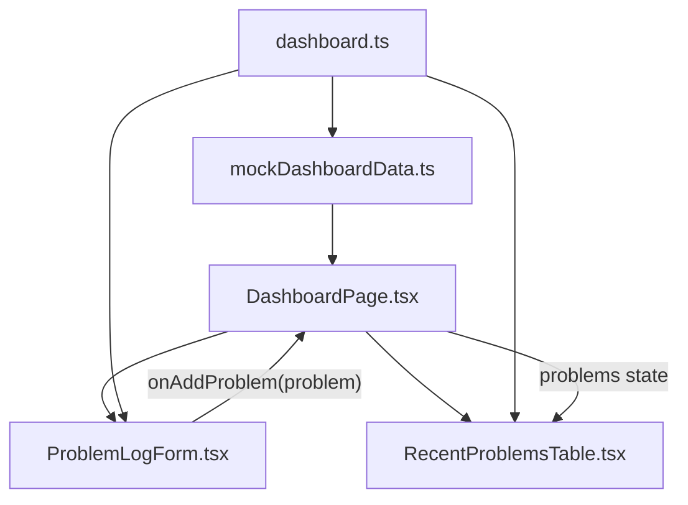

# Problem Logging UI With Local State Design

## Objective

Build a frontend-only workflow that lets a user log a solved problem into local React state and immediately see it in the dashboard problem list.

GitHub Issue: `https://github.com/kprashanth01/leettrack/issues/5`

## Why This Comes Next

The dashboard app shell now shows mock progress data. The next useful product workflow is adding a solved problem. We will keep the data local to the browser for this milestone so we can learn form state, validation, and parent-child data flow before introducing backend APIs or database persistence.

This milestone teaches:

- controlled React forms;
- local component state;
- lifting state to the nearest shared parent;
- validation and user feedback;
- keeping presentational components reusable;
- evolving mock data toward real user-entered data.

## Chosen Approach

Use an inline dashboard panel for problem logging.

```text
DashboardPage
  owns local problems state
  passes problems to RecentProblemsTable
  passes onAddProblem to ProblemLogForm

ProblemLogForm
  owns controlled input values
  validates required fields
  emits a new SolvedProblem to DashboardPage

RecentProblemsTable
  remains presentational
  renders the problems prop
```

## Alternatives Considered

### Inline dashboard panel

This keeps the main workflow visible and simple. It is the best fit for learning React state because the form and problem list share one parent.

### Modal form

A modal is common in production apps, but it adds focus management, escape handling, overlay behavior, and more complex state. That is unnecessary for this milestone.

### Separate problems page

A separate page will make sense once React Router is introduced. For now, adding router just to host one form would be premature.

## Architecture

Only the frontend changes in this milestone.



No backend server, API client, database, authentication, or persistence layer is used.

## Proposed File Changes

```text
frontend/src/
  data/
    mockDashboardData.ts      modify if default problem ordering needs cleanup
  features/
    dashboard/
      DashboardPage.tsx       modify to own local state
      ProblemLogForm.tsx      create
      RecentProblemsTable.tsx modify only if display needs minor support
  types/
    dashboard.ts              extend types only if needed
  styles.css                  add form styles
```

## Component Responsibilities

### `DashboardPage.tsx`

Owns the `problems` state. It should initialize from `recentProblems`, pass `problems` into `RecentProblemsTable`, and pass an `addProblem` callback into `ProblemLogForm`.

The new problem should appear at the top of the list so the user sees immediate feedback.

### `ProblemLogForm.tsx`

Owns form input values and validation messages. It should collect:

- title;
- difficulty;
- tags;
- status;
- solved date label;
- notes.

The form should require:

- title;
- at least one tag;
- solved date label.

Difficulty and status can have default values.

On successful submit:

- create a `SolvedProblem` object;
- call `onAddProblem(problem)`;
- clear the form fields that should reset;
- show a short success message.

### `RecentProblemsTable.tsx`

Should remain presentational. It receives a `problems` prop and renders it. It should not own problem state or know where the data came from.

## Data Shape

Use the existing `SolvedProblem` type:

```ts
export type SolvedProblem = {
  id: string;
  title: string;
  difficulty: Difficulty;
  tags: string[];
  status: ProblemStatus;
  solvedAt: string;
  note?: string;
};
```

Notes are optional on a logged problem. When the user enters a note, the new problem should keep that note in local React state and display it under the problem title in the recent problems list. This keeps the form honest: if the UI asks for notes, the local workflow should preserve them.

## Validation Rules

Validation should run on submit.

Rules:

- title must not be empty;
- tags must contain at least one non-empty tag;
- solved date label must not be empty.

Tags should be entered as comma-separated text:

```text
Array, Hash Map, Sliding Window
```

The form should trim whitespace and remove empty tag entries.

## Visual Direction

The form should feel like part of the existing dashboard:

- use the same card radius, border, and spacing;
- fit into the dashboard grid without dominating the page;
- keep labels readable;
- show validation feedback close to the field;
- avoid modal or drawer behavior;
- remain readable on mobile.

## Scope

Include:

- inline problem logging form;
- controlled inputs;
- local React state in `DashboardPage`;
- submit validation;
- newly submitted problem appears in the recent problems list;
- form reset after successful submit;
- responsive styling;
- passing frontend build.

Do not include:

- backend API calls;
- localStorage persistence;
- database persistence;
- authentication;
- React Router;
- Axios;
- TanStack Query;
- search and filters;
- edit/delete problem actions;
- revision scheduler logic;
- AI features.

## Testing And Verification

Manual verification should include:

- run `npm run build` inside `frontend/`;
- submit the form with empty required fields and confirm validation messages appear;
- submit a valid problem and confirm it appears at the top of the problem list;
- confirm the dashboard still renders default mock problems on initial load;
- confirm no backend server is required;
- verify desktop layout;
- verify mobile layout has no horizontal overflow.

Edge cases:

- tags with extra spaces should be trimmed;
- consecutive commas should not create empty tags;
- duplicate tags should be deduplicated while preserving first occurrence order;
- a long problem title should wrap without breaking layout;
- validation should clear after a successful submit.

## Git Workflow

Issue:

```text
#5 Build problem logging UI with local mock state
```

Branch:

```text
feature/problem-logging-ui
```

Suggested design commit:

```text
docs(frontend): define problem logging local state design
```

Suggested implementation commit:

```text
feat(frontend): add local problem logging form
```

## Suggested Pull Request Description

```markdown
## Summary
- Add an inline problem logging form to the dashboard.
- Store submitted problems in local React state.
- Show newly logged problems in the recent problems list.
- Add validation for required form fields.

## Test Plan
- npm run build
- Submit empty form and verify validation messages
- Submit valid problem and verify it appears in the list
- Verify mobile layout has no horizontal overflow

Closes #5
```

## Next Milestone After This

After this is reviewed and merged, the next good milestone is either:

- add edit/delete behavior for locally logged problems;
- add search/filter behavior for the problem list;
- design the first backend problem-log API and database schema.

The recommended next milestone is search/filter behavior because it improves the dashboard workflow without introducing persistence yet.
